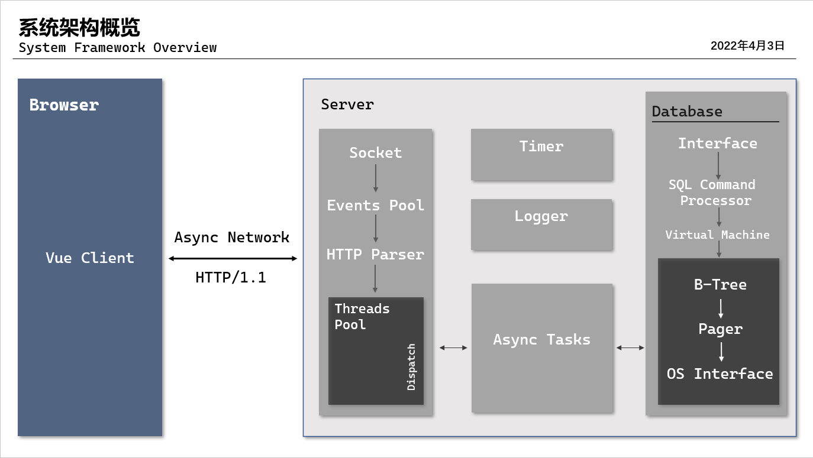

# **TinyAndPretty 高校信息助理平台**


    🎉感谢您的驻足。如果本项目对您有帮助，请点一个✨Star表示支持~
本项目为北京邮电大学计算机学院2022学年**数据结构课程设计**第六小组的拙作。项目涵盖了**B+Tree数据库原理与实现** 、 **Linux服务器开发实战** 、 **Vue前端设计部署** 、 **数据结构与算法**等诸多方面的全栈开发。从零开始共耗时三个月，历经近200次`commits`。模块**核心**部分精心匠造，注释文档~~全面~~、代码规范~~可靠~~；**业务**部分敏捷开发，基本囊括常见互联网业务。

> 项目在线演示请戳这里👉[  Tiny & Pretty  ](http://noui.cloud) 👈 (服务器已关闭)
> 
> 项目部分接口请戳这里👉[  APIFox  ](https://www.apifox.cn/apidoc/shared-255bbbcd-f00c-49a0-8c43-55d8677cf172) 👈
>
> 项目在线文档请戳这里👉[  Design  ](https://docs.qq.com/doc/DR2p3RVZMVm93TE9J) 👈
>
> 网站操作指南请戳这里👉[  Instruction  ](https://docs.qq.com/doc/DR0tqR0lTSWtUTWlu) 👈


主体负责人和部分细分模块如下
|Member|Jobs|
|:---:|:---:|
|[@Jianxff](https://github.com/Jianxff) |[NEDB](https://github.com/Jianxff/NEDB) / [Vue Page](https://github.com/Jianxff/TAP-frontend) / User Token |
|[@LingZichao](https://github.com/LingZichao)| [HTTP Server](https://github.com/LingZichao/Tasty) / [JSON](https://github.com/LingZichao/SimpleJson) / Makefile |
|[@Kqramazov](https://github.com/Kqramazov)| MD5 / A* / Landscaping |

您的每一次`issue`我们都将认真考虑，因此对于仍然存在的`BUG`或者`Advice`，欢迎您及时与我们沟通联系。

最后感谢各位组员的辛勤劳动，特别鸣谢王老师在课程中的细心答疑。

## 一.目录文件说明 ##
```
.
├── include                     //存放头文件（接口声明）
│   ├── common.h                //程序共用头
│   ├── interfaces.h            //模块接口,包含所有模块对外使用的函数定义
│   ├── connect                 //网络通信模块
│   │   ├── HttpProtocal        //Http请求相应 
│   │   │── Network             //服务器模块
│   │   └── Timer               //定时器有关的长连接支持
│   │
│   ├── libs
│   │   ├── BalanceTree.h       //B+树模板
│   │   ├── BasicUtils.h        //基本小工具
│   │   ├── Heap.hpp            //小根堆实现
│   │   ├── HashMap.hpp         //蛤希表的实现
│   │   ├── md5.h               //MD5加密
│   │   ├── NEdb.h              //数据库接口头文件
│   │   └── SimpleJson.hpp      //JSON生成
│   │
│   ├── service                 //后端业务服务模块
│   │
│   ├── router.conf             //URL路由配置文件
│   └── test                    //测试模块
│
├── lib
│   └── libnedb.a               //数据库静态库文件
│
├── Kconfig                     //参数配置
├── LICENSE
├── Makefile
├── README.md
│
├── scripts                     //存放脚本及文档
│
├── src                         //项目源代码
│   ├── main.cpp                //主服务入口
│   ├── server                  
│   │   ├── HttpProtocal        //Http相关解析的实现
│   │   ├── MD5                 //MD5算法的实现
│   │   ├── Timer               //服务器长连接有关的实现
│   │   └── Network             //服务器底层组件的实现
│   │
│   ├── service                 //后台业务逻辑的实现
│   ├── controller              //用户权限控制
│   │
│   └── test                    //测试接口
│
├── web                         //旧版本的网页文件
├── data                        //数据表文件
│   ├── src
│   │   ├── major
│   │   └── school
│   ├── sys
│   │   ├── test
│   │   └── token
│   └── user
│
│
└── utils               //存放杂项
```

## 二.自动化指令说明 ##
在项目文件夹根目录下使用如下指令，可快速使用相应功能。
* i . 编译并运行。🚥请在`Linux`环境下配置服务器！
```
    $ make run
```

* ii . 清除`build`编译文件夹。`disrclean`可清除`menuconfig`生成的配置文件。
```
    $ make (dist)?clean
```
* iii . 启动菜单配置，调整程序运行参数
```
    $ make menuconfig
```
