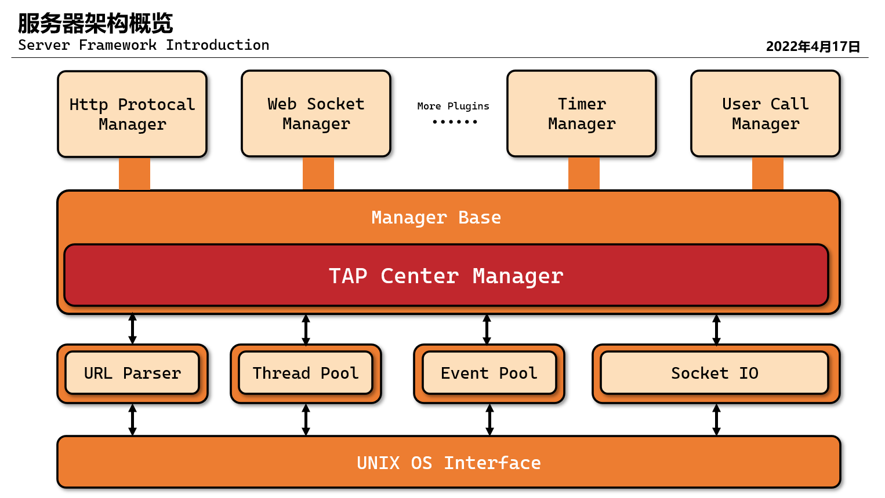

# **TinyAndPretty 小而美的网络服务框架**
TinyAndPretty(TAP)是使用`Modern C++(11/14/17)`开发的网络服务框架，它秉持简单、易用、可扩展易开发的原则，帮助你快速构建~~可靠~~的``C++``后台服务。

## 分层的微核架构 ##
TAP主体采用[微核架构](http://www.ruanyifeng.com/blog/2016/09/software-architecture.html)`（microkernel architecture）`，又称为"插件架构"`（plug-in architecture）`。TAP Center Manager（TAP中枢管理员）会负责系统整体的初始化、子管理员（plugins）的协调与调度，主要功能和业务逻辑都通过插件实现。
* 良好的功能延伸性`（extensibility）`，需要什么功能，开发一个插件即可.
* 功能之间是隔离的，插件可以独立的加载和卸载，使得它比较容易部署.
* 可定制性高，适应不同的开发需要
* 可以渐进式地开发，逐步增加功能

## UNIX友好的配置方式 ##
移植了`Kconfig`系统，在纯命令行环境下也有对人类友好的配置体验，可视化界面充分展示系统的所有细节。